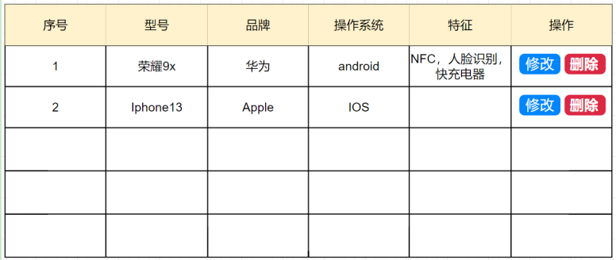
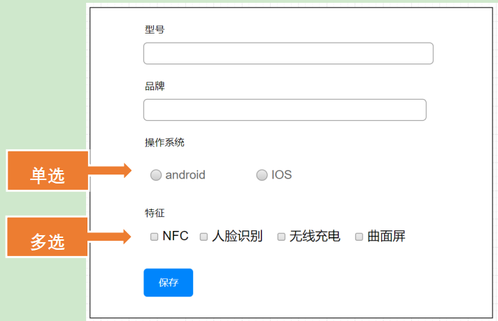

# 基于Spring+Hibernate 实现手机列表CURD
*相应的sql已准备好，config.xml根据实际情况配置*

[演示视频](https://www.bilibili.com/video/BV1zZ4y1e71r/?vd_source=ea2fae5d4f0f5c1e25984fab0fbbcd44)
 

## 线框图
---
  
 

 
> ps: 这里我遇到的难点是对已勾选的复选框，在进行更新操作时数据如何回显页面。网上找了很久的资料，零碎地结合写出来了，效果可以实现，但老师说这不是最佳实践。{^… …^'}
